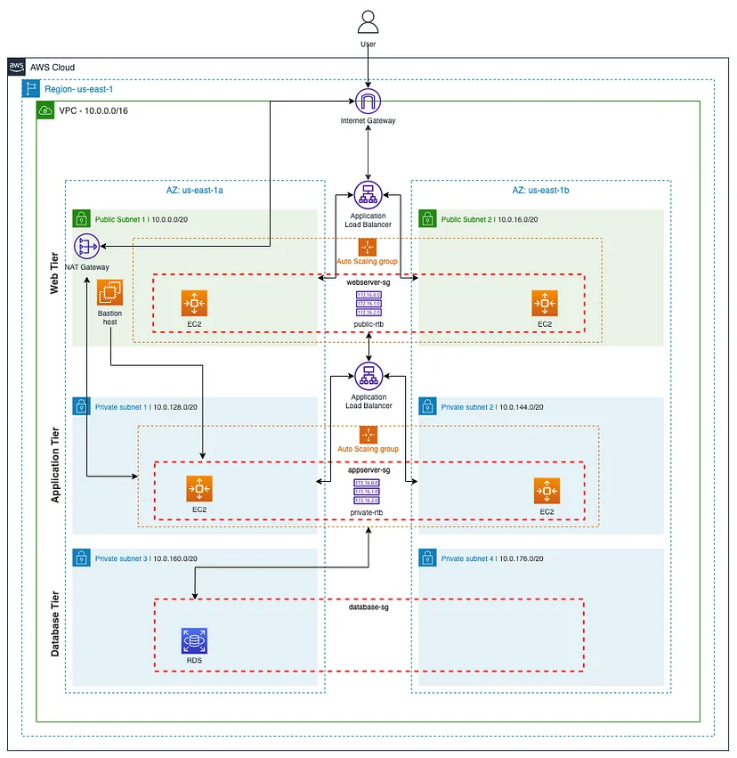

# Final Consolidation – End-to-End Cloud Architecture

This chapter consolidates all the cloud fundamentals covered in this repository
into a single, clear system view.

The goal is to understand **how real cloud systems are designed, secured,
monitored, and operated**, not just how individual services work.

---

## The Core Cloud Design Philosophy

Modern cloud systems follow these principles:

- Compute is **stateless and replaceable**
- Data lives in **managed services**
- Access is controlled using **identity, not secrets**
- Systems are **observable**
- Failures are expected and handled automatically

Every AWS service used in this repository supports one or more of these ideas.

---

## Final Architecture Overview
User
→ Application Load Balancer (Public Subnet)
→ Auto Scaling Group
→ EC2 Instances (Private Subnet)
→ IAM Role
→ Amazon S3 (Data, Logs, Backups)
→ CloudWatch (Metrics, Logs, Alarms)
→ SNS (Notifications)

This architecture represents a **production-grade baseline system**.

---

## Component-by-Component Reasoning

### 1. Load Balancer (ALB)

Why it exists:
- Distributes traffic across instances
- Provides a single public entry point
- Enables high availability

Key idea:
> Users never talk directly to EC2.

---

### 2. Auto Scaling Group (ASG)

Why it exists:
- Maintains desired instance count
- Replaces unhealthy instances
- Scales based on demand

Key idea:
> Individual servers are disposable.

---

### 3. EC2 Instances (Private Subnet)

Why private:
- No direct internet exposure
- Reduced attack surface

Role of EC2:
- Run application code
- Do NOT store permanent data

Key idea:
> EC2 is compute, not storage.

---

### 4. IAM Role (Security Foundation)

Why roles:
- No hardcoded credentials
- Temporary, rotated permissions
- Least privilege access

Flow:
EC2 → IAM Role → Temporary Credentials → AWS Services

Key idea:
> Identity controls access, not passwords.

---

### 5. Amazon S3 (Data Layer)

Why S3:
- Independent of EC2
- Highly durable
- Scales automatically

Used for:
- User uploads
- Logs
- Backups
- Shared data

Key idea:
> Data must survive compute failure.

---

### 6. CloudWatch (Observability Layer)

Why monitoring:
- Systems fail silently without it
- Engineers need visibility

What CloudWatch provides:
- Metrics → health signals
- Logs → root cause
- Alarms → early detection

Key idea:
> You cannot operate what you cannot observe.

---

### 7. SNS (Alerting)

Why notifications:
- Humans must be alerted
- Automated systems still need oversight

Flow:
CloudWatch Alarm → SNS → Engineer

Key idea:
> Monitoring without alerting is incomplete.

---

## Failure Handling (End-to-End Thinking)

### Scenario: EC2 Instance Crashes

What happens:
1. CloudWatch detects health failure
2. ASG terminates unhealthy instance
3. ASG launches replacement
4. ALB routes traffic to healthy instance
5. Engineer is alerted if needed

User impact:
- Minimal or none

---

### Scenario: High Traffic Spike

What happens:
1. CPU or request count increases
2. CloudWatch alarm triggers
3. ASG scales out
4. ALB distributes traffic
5. System stabilizes

Key idea:
> Scaling is proactive, not reactive.

---

## Security Posture Summary

- No public EC2 instances
- No stored access keys
- IAM roles enforce least privilege
- S3 is private by default
- Public access is explicitly controlled

This reduces:
- Data leaks
- Unauthorized access
- Blast radius

---

## Cost & Efficiency Awareness

- Auto Scaling prevents over-provisioning
- Lifecycle policies control storage cost
- Stateless EC2 avoids wasted resources
- Monitoring helps detect inefficiencies

Key idea:
> Good architecture saves money automatically.

---

## How to Explain This in Interviews (Golden Script)

> “I design systems where EC2 instances are stateless and placed in private subnets behind a load balancer and auto scaling group. Access to AWS services is handled using IAM roles with least privilege. Application data, logs, and backups are stored in S3. CloudWatch is used to monitor system health using metrics and alarms, and SNS is used for alerting. This ensures scalability, security, and high availability.”

That answer alone places you **above most freshers**.

---

## What This Repository Achieves

By completing this repository, you now understand:

- How cloud systems are structured
- Why each component exists
- How failures are handled
- How security is enforced
- How systems are monitored
- How to explain architecture clearly

This is the **foundation required** for:
- Cloud Engineer roles
- Cloud Support roles
- DevOps learning (next phase)
- Advanced AWS services
- Real-world production work

---

## Final Note

This repository focuses on **thinking like an engineer**, not memorizing services.

If you understand this chapter, you understand **cloud fundamentals properly**.

## High-Level Cloud Architecture

This diagram shows the complete end-to-end cloud system, starting from the user
request, passing through the load balancer and auto scaling group, and finally
reaching storage and monitoring layers.
